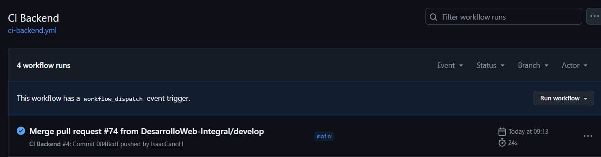
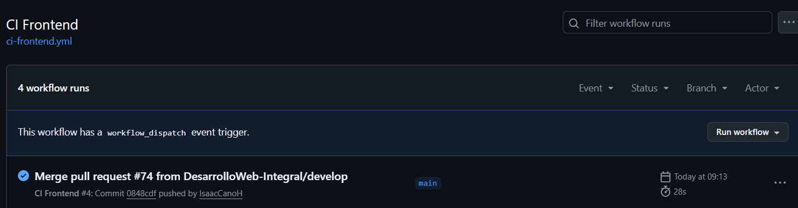
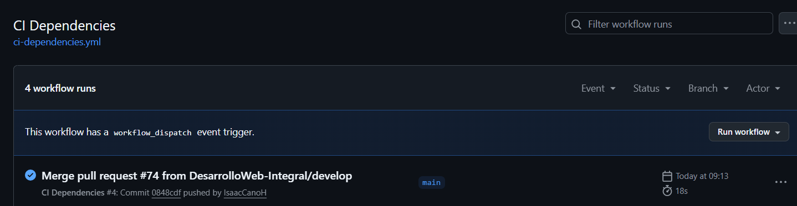
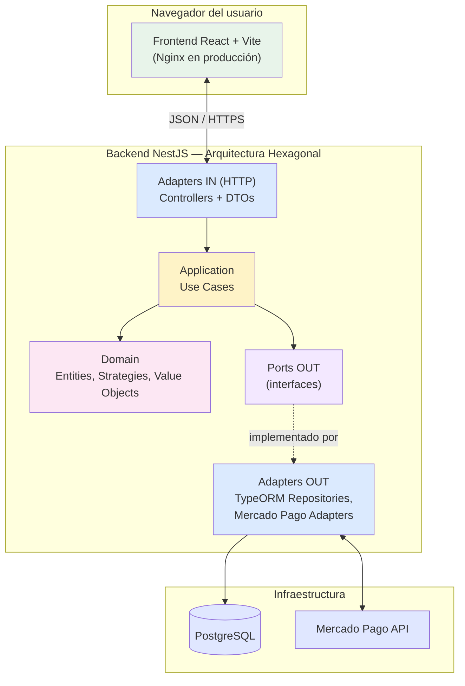

<p align="center">
  <a href="http://nestjs.com/" target="blank"></a>
  <a href="https://es.react.dev/" target="blank"></a>
  <a href="https://www.postgresql.org/" target="blank"></a>
</p>

# Aplicacion Agricola

Proyecto web agricola con dos aplicaciones:

- `backend-crm-agricola`: API con NestJS, TypeORM y PostgreSQL.
- `frontend-crm-agricola`: cliente web con React, Vite y Bootstrap.

## Demo en producción

| Servicio      | URL                                         |
| ------------- | ------------------------------------------- |
| Frontend      | https://ecommerce-agricola-web.onrender.com |
| Backend (API) | https://ecommerce-agricola-api.onrender.com |

La aplicación está disponible públicamente sobre HTTPS (certificado provisto automáticamente por Render). El despliegue se ejecuta de forma automática al fusionar cambios en la rama `main`.

## Ejecutar todo con Docker

El archivo `docker-compose.yml` de la raiz inicia PostgreSQL, backend y frontend.
Docker Compose usa valores locales predeterminados. Para personalizarlos, copia
`.env.example` como `.env` en esta misma carpeta y edita sus valores.
Las credenciales de integraciones privadas, como Mercado Pago, se cargan desde
`backend-crm-agricola/.env`.

Desde la carpeta raiz del proyecto ejecuta:

```bash
docker compose up --build
```

La aplicacion queda disponible en:

- Frontend: `http://localhost:5173`
- Backend: `http://localhost:3000`
- PostgreSQL: disponible internamente para el backend como `postgres:5432`

Para iniciarla en segundo plano:

```bash
docker compose up --build -d
```

Para detener los contenedores sin borrar los datos:

```bash
docker compose down
```

Para detenerlos y borrar tambien el volumen de PostgreSQL:

```bash
docker compose down -v
```

> El ultimo comando elimina los datos locales de la base de datos.

## Requisitos

- Node.js y npm
- Docker Desktop
- Git

## Instalacion

Desde la carpeta raiz del proyecto:

```bash
npm install
```

Instala tambien las dependencias de cada aplicacion:

```bash
cd backend-crm-agricola
npm install

cd ../frontend-crm-agricola
npm install
```

## Backend

Entra a la carpeta del backend:

```bash
cd backend-crm-agricola
```

Crea el archivo `.env` a partir de `.env.template` y configura las variables:

Levanta la base de datos:

```bash
docker-compose up -d
```

Inicia el backend:

```bash
npm run start:dev
```

El backend queda disponible en:

```text
http://localhost:3000
```

## Frontend

Entra a la carpeta del frontend:

```bash
cd frontend-crm-agricola
```

Crea o revisa el archivo `.env` a partir de `.env.template` y configura las variables:

Inicia el frontend:

```bash
npm run dev
```

El frontend queda disponible en:

```text
http://localhost:5173
```

## Orden recomendado para ejecutar

1. Levantar PostgreSQL con `docker-compose up -d` dentro de `backend-crm-agricola`.
2. Levantar el backend con `npm run start:dev`.
3. Levantar el frontend con `npm run dev`.

## Comandos utiles

Backend:

```bash
npm run build
npm run lint
```

Frontend:

```bash
npm run build
npm run lint
```

## Integración continua (CI/CD)

El repositorio cuenta con tres workflows de GitHub Actions que se ejecutan automáticamente en cada `push` o `pull request` hacia `main`:

| Workflow              | Valida                                                                       | Cuándo corre                          |
| --------------------- | ---------------------------------------------------------------------------- | ------------------------------------- |
| `ci-backend.yml`      | Instalación de dependencias y compilación (`npm run build`) del backend      | Cambios en `backend-crm-agricola/**`  |
| `ci-frontend.yml`     | Lint (`npm run lint`) y compilación (`npm run build`) del frontend           | Cambios en `frontend-crm-agricola/**` |
| `ci-dependencies.yml` | Integridad de `package.json`/`package-lock.json` en ambos proyectos (matrix) | Cambios en archivos de dependencias   |

El despliegue en Render se dispara automáticamente al fusionar cambios en `main`, una vez que los checks de GitHub Actions pasan correctamente.

**Evidencia de ejecución:** ver la pestaña [Actions](https://github.com/DesarrolloWeb-Integral/eCommerce-Agricola/actions) del repositorio.





## Arquitectura

El backend sigue una **arquitectura hexagonal (ports & adapters)**, organizada por módulos de dominio (`auth`, `usuarios`, `productos`, `pedidos`, `payments`, `chat`, `producer-profile`, etc.). Cada módulo se divide en:

- **`domain/`** — entidades y lógica de negocio pura, sin dependencias de frameworks ni de TypeORM.
- **`application/`** — casos de uso que orquestan el dominio y dependen únicamente de _ports_ (interfaces).
- **`ports/out/`** — interfaces que el dominio/aplicación define, implementadas por los adapters.
- **`adapters/`** — implementaciones concretas de entrada (`in/http`, controllers) y salida (`out/persistence` con TypeORM, `out/mercado-pago`, etc.).



### Repository Pattern

Cada entidad principal (productos, pedidos, usuarios, pagos, perfiles de productor) define un **port** con la interfaz de persistencia que necesita el dominio, y un **adapter** que la implementa usando TypeORM. Los use-cases dependen solo del port, nunca de TypeORM directamente.

```typescript
// ports/out/producto-repository.port.ts
export interface ProductoRepositoryPort {
  findById(id: string): Promise<Producto | null>;
  searchByNombre(nombre: string): Promise<Producto[]>;
  reservarStock(id: string, quantity: number): Promise<boolean>;
}

// adapters/out/persistence/typeorm/repositories/typeorm-producto.repository.ts
@Injectable()
export class TypeormProductoRepository implements ProductoRepositoryPort {
  constructor(
    @InjectRepository(ProductoEntity)
    private readonly repo: Repository<ProductoEntity>,
  ) {}
  // implementación con QueryBuilder parametrizado
}
```

El mismo patrón se repite en `pedidos`, `usuarios`, `payments` y `chat`.

### Strategy Pattern

El cálculo de comisiones sobre pagos usa Strategy Pattern para desacoplar el algoritmo de cálculo del resto de la lógica de creación de pagos.

```typescript
// domain/strategies/comision.strategy.ts
export interface ComisionStrategy {
  calcular(subtotal: number): number;
}

// domain/strategies/comision-porcentaje-fijo.strategy.ts
export class ComisionPorcentajeFijoStrategy implements ComisionStrategy {
  constructor(private readonly porcentaje: number) {
    /* ... */
  }
  calcular(subtotal: number): number {
    /* ... */
  }
}

// domain/services/pago.factory.ts — depende solo de la interfaz
export class PagoFactory {
  constructor(private readonly comisionStrategy: ComisionStrategy) {}
  crear(input: CrearPagoInput): Pago {
    const comision = this.comisionStrategy.calcular(input.subtotal);
    // ...
  }
}
```

La estrategia concreta se resuelve en `pagos-comisiones.module.ts` mediante un factory provider configurable por variable de entorno (`PAYMENT_PLATFORM_COMMISSION_PERCENTAGE`), lo que permite agregar nuevas estrategias de comisión sin modificar `PagoFactory` ni ningún use-case consumidor.

## Endpoints principales de la API

Todas las rutas responden en formato JSON. Las marcadas con 🔒 requieren cookie de sesión válida (JWT).

**Autenticación** (`/auth`)

| Método | Ruta            | Descripción                                |
| ------ | --------------- | ------------------------------------------ |
| POST   | `/auth/login`   | Inicia sesión y establece cookies httpOnly |
| POST   | `/auth/refresh` | Renueva el access token                    |
| POST   | `/auth/logout`  | Cierra sesión                              |
| GET 🔒 | `/auth/me`      | Usuario autenticado actual                 |

**Usuarios** (`/usuarios`)

| Método   | Ruta                 | Descripción                                     |
| -------- | -------------------- | ----------------------------------------------- |
| POST     | `/usuarios/registro` | Registra un nuevo usuario (CLIENTE o PROVEEDOR) |
| PATCH 🔒 | `/usuarios/perfil`   | Edita el perfil propio                          |

**Productos** (`/productos`)

| Método   | Ruta                              | Descripción                          |
| -------- | --------------------------------- | ------------------------------------ |
| GET      | `/productos/buscar?nombre=`       | Busca productos disponibles          |
| GET      | `/productos/categoria/:categoria` | Filtra por categoría                 |
| POST 🔒  | `/productos`                      | Registra un producto (rol PROVEEDOR) |
| PATCH 🔒 | `/productos/:id`                  | Edita un producto propio             |

**Pedidos** (`/pedidos`)

| Método   | Ruta                     | Descripción                                               |
| -------- | ------------------------ | --------------------------------------------------------- |
| POST 🔒  | `/pedidos`               | Crea un pedido (rol CLIENTE)                              |
| GET 🔒   | `/pedidos/mis-pedidos`   | Pedidos del cliente autenticado                           |
| GET 🔒   | `/pedidos/mis-productos` | Pedidos recibidos sobre productos propios (rol PROVEEDOR) |
| PATCH 🔒 | `/pedidos/:id/cancelar`  | Cancela un pedido propio                                  |

**Pagos** (`/pagos`)

| Método  | Ruta              | Descripción                                    |
| ------- | ----------------- | ---------------------------------------------- |
| POST 🔒 | `/pagos/checkout` | Inicia checkout con Mercado Pago               |
| POST    | `/pagos/webhook`  | Webhook de notificaciones (validado por firma) |

**Chat** (`/chat`)

| Método  | Ruta                                | Descripción                                        |
| ------- | ----------------------------------- | -------------------------------------------------- |
| POST 🔒 | `/chat/conversaciones`              | Inicia una conversación sobre un producto o pedido |
| GET 🔒  | `/chat/conversaciones`              | Conversaciones del usuario autenticado             |
| POST 🔒 | `/chat/conversaciones/:id/mensajes` | Envía un mensaje                                   |
| GET 🔒  | `/chat/conversaciones/:id/mensajes` | Mensajes de una conversación propia                |
